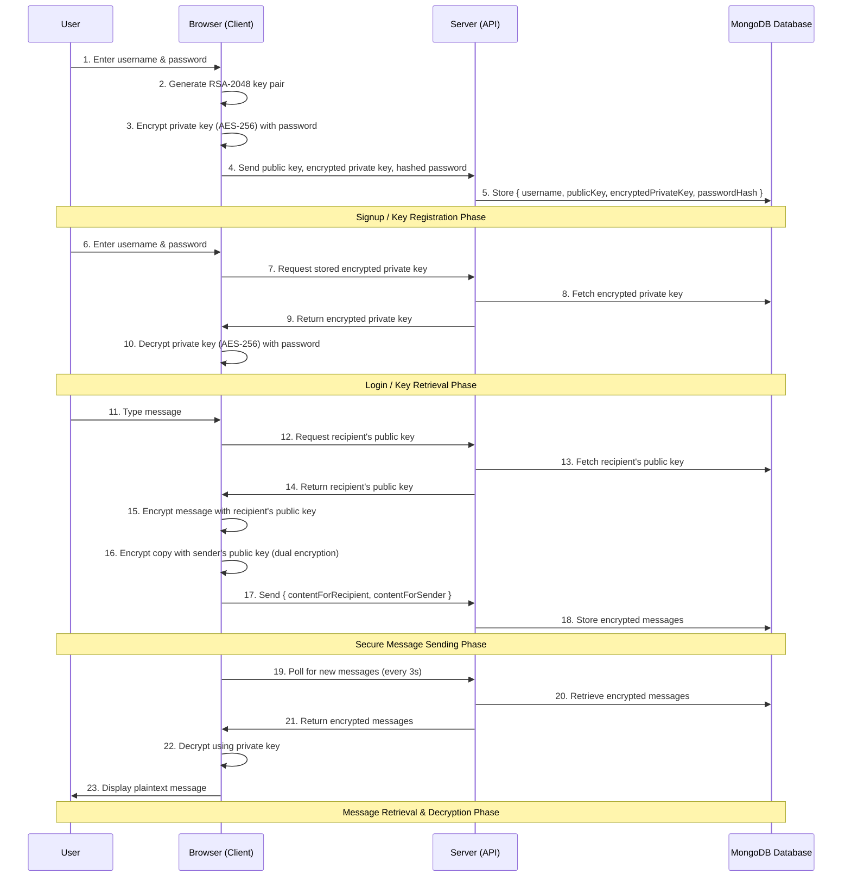

# CryptChat - End-to-End Encrypted Messaging Platform

## Table of Contents

- [Introduction](#introduction)
- [Features](#features)
- [Security Architecture](#security-architecture)
- [Tech Stack](#tech-stack)
- [Installation](#installation)
- [Configuration](#configuration)
- [Development](#development)
- [Deployment](#deployment)
- [Contributing](#contributing)
- [License](#license)

## Introduction

CryptChat is a secure messaging application that implements true end-to-end encryption (E2EE) using modern cryptographic standards. Messages are encrypted on the client-side before transmission and can only be decrypted by the intended recipient.

## Features

- 🔐 **Dual-Key Encryption** (RSA-2048 + AES-256)
- 🛡️ **Zero-Knowledge Architecture** (Server never sees plaintext)
- 🔄 **Message Persistence** (Encrypted storage with dual-key access)
- 📱 **Responsive UI** (Works on desktop and mobile)
- 🔑 **Secure Key Management** (Password-protected private keys)
- ⚡ **Real-Time Updates** (WebSocket-based messaging)

## Security Architecture



## Tech Stack

### Core Technologies

- **Frontend**: Next.js 14, React 18, TypeScript 5
- **Styling**: Tailwind CSS 3, shadcn/ui
- **Cryptography**: Web Crypto API, RSA-OAEP, AES-GCM
- **Backend**: Next.js API Routes
- **Database**: MongoDB (with encrypted data storage)
- **Authentication**: NextAuth.js (JWT sessions)

### Security Modules

| Component           | Implementation Details               |
| ------------------- | ------------------------------------ |
| Key Generation      | RSA-2048 via `window.crypto.subtle`  |
| Private Key Storage | AES-256 encrypted with user password |
| Message Encryption  | RSA-OAEP + AES-GCM hybrid            |
| Session Management  | HttpOnly, Secure JWT cookies         |

## Installation

1. Clone the repository:

```bash
git clone https://github.com/mahfuz271/cryptchat.git
cd cryptchat
```

2. Install dependencies:

```bash
npm install
# or
yarn install
```

3. Set up environment variables:

```bash
cp .env.example .env.local
```

## Configuration

Required environment variables:

```env
MONGODB_URI=mongodb://localhost:27017/cryptchat
NEXTAUTH_SECRET=your-strong-secret-here
NEXTAUTH_URL=http://localhost:3000
```

## Development

```bash
npm run dev
# or
yarn dev
```

Open [http://localhost:3000](http://localhost:3000) in your browser.

## Deployment

### Vercel

[](https://vercel.com/new/clone?repository-url=https%3A%2F%2Fgithub.com%2Fmahfuz271%2Fcryptchat)

## Contributing

We welcome contributions! Please follow these steps:

1. Fork the repository
2. Create your feature branch (`git checkout -b feature/AmazingFeature`)
3. Commit your changes (`git commit -m 'Add some AmazingFeature'`)
4. Push to the branch (`git push origin feature/AmazingFeature`)
5. Open a Pull Request

## License

Distributed under the GNU AGPLv3 License. See `LICENSE` for more information.

## Acknowledgments

- Web Cryptography API documentation
- Next.js authentication patterns
- Modern cryptographic best practices

---

**Security Notice**: This project implements strong encryption, but should not be considered production-ready without a full security audit. Use at your own risk for sensitive communications.
